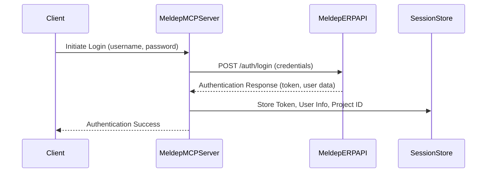
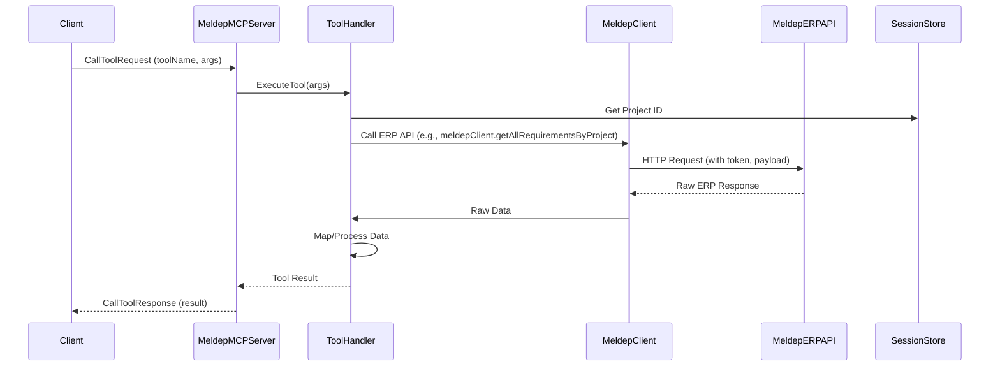
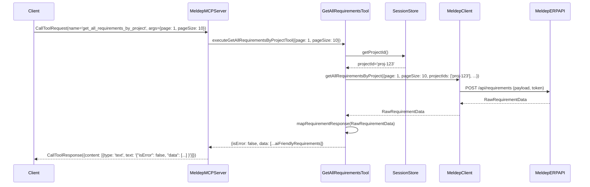

<details>
<summary>Relevant source files</summary>

The following files were used as context:
- `C:\Users\User\AppData\Local\Temp\tdg_i30ala75\meldep-mcp-main\src\server\tools\requirement\get-all-requirements-by-project.tool.ts`
- `C:\Users\User\AppData\Local\Temp\tdg_i30ala75\meldep-mcp-main\src\server\index.ts`
- `C:\Users\User\AppData\Local\Temp\tdg_i30ala75\meldep-mcp-main\src\server\config\meldep.config.ts`
- `C:\Users\User\AppData\Local\Temp\tdg_i30ala75\meldep-mcp-main\src\server\config\env.ts`
- `C:\Users\User\AppData\Local\Temp\tdg_i30ala75\meldep-mcp-main\src\server\auth\login.ts`
</details>

# System Architecture

The Meldep MCP (Model Context Protocol) server acts as an intermediary, exposing functionalities of the Meldep ERP system through a standardized protocol. This architecture is designed to allow external systems, such as AI agents, to interact with ERP data and operations in a structured and efficient manner. The server handles authentication, session management, and the orchestration of tool calls to specific ERP functionalities.

The core of the system revolves around the Model Context Protocol (MCP) SDK, which provides the framework for building the server. This server exposes a set of "tools" that represent specific actions or data retrieval operations within the Meldep ERP. These tools are discoverable and callable via the MCP protocol, enabling seamless integration.

## High-Level Overview

The Meldep MCP server is a Node.js application that leverages the `@modelcontextprotocol/sdk`. It starts by parsing command-line arguments for authentication and project context. Upon successful authentication, it establishes an MCP server instance, registers available tools, and sets up handlers for tool listing and execution requests. The server then listens for incoming MCP messages via a standard input/output transport.

```mermaid
flowchart TD
    A[Client Application] --> B(MCP Protocol);
    B --> C{Meldep MCP Server};
    C --> D[Authentication];
    C --> E[Session Management];
    C --> F[Tool Registration];
    C --> G[Tool Execution];
    G --> H[Meldep ERP API];
    H --> I[Data/Response];
    I --> G;
    G --> C;
    C --> B;
    B --> A;
```



## Core Components

The Meldep MCP server is composed of several key components that work together to provide its functionality.

### 1. MCP Server Framework

The `@modelcontextprotocol/sdk/server` package provides the foundational classes and interfaces for building an MCP server. The `Server` class is the main entry point, responsible for managing connections, request handlers, and capabilities.

```typescript
// Example from server/index.ts
import { Server } from '@modelcontextprotocol/sdk/server/index.js';
// ...
const server = new Server({
    name: 'meldep-mcp',
    version: '1.0.2',
}, {
    capabilities: {
        tools: {},
    },
});
```

### 2. Transport Layer

The `StdioServerTransport` from `@modelcontextprotocol/sdk/server/stdio.js` is used to establish communication between the MCP server and its clients. This transport mechanism uses standard input and output streams, which is a common pattern for inter-process communication in Node.js environments, especially when interacting with AI models.

```typescript
// Example from server/index.ts
import { StdioServerTransport } from '@modelcontextprotocol/sdk/server/stdio.js';
// ...
const transport = new StdioServerTransport();
await server.connect(transport);
```

### 3. Authentication and Session Management

The server requires authentication to access Meldep ERP functionalities. The `login` function handles user authentication against the ERP. Upon successful login, user and session details are stored using `sessionStore`. This includes tokens, user information, and the `projectId`, which is crucial for context-aware operations.

#### Authentication Flow



#### Login Function

```typescript
// File: src/server/auth/login.ts
import { HttpClient } from '../client/http-client.js';
import { ERP_ENDPOINTS } from '../client/endpoints.js';
import { meldepConfig } from '../config/meldep.config.js';
import { tokenManager } from './token-manager.js';
import { sessionStore } from './session-store.js';

export async function login(credentials) {
    try {
        const httpClient = new HttpClient(meldepConfig.baseURL);
        const response = await httpClient.post(ERP_ENDPOINTS.AUTH.LOGIN, credentials);
        // ... process response and store session data
        return true; // or false on failure
    } catch (error) {
        // ... handle error
        return false;
    }
}
```

#### Session Store

The `sessionStore` is a simple in-memory store for managing session-specific data like the authenticated user's token, username, and the currently active `projectId`.

```typescript
// File: src/server/auth/session-store.ts (Conceptual)
class SessionStore {
    private store: Record<string, any> = {};

    set(key: string, value: any): void {
        this.store[key] = value;
    }

    get(key: string): any | undefined {
        return this.store[key];
    }

    getProjectId(): string | undefined {
        return this.get('projectId');
    }
}
export const sessionStore = new SessionStore();
```

### 4. Tools

Tools represent the specific operations that the MCP server can perform. Each tool has a name, a description, and an input schema. The server exposes a list of available tools and handles the execution of these tools when requested by a client.

#### Tool Definition Example (`get_all_requirements_by_project`)

```typescript
// File: src/server/tools/requirement/get-all-requirements-by-project.tool.ts
export const getAllRequirementsByProjectTool = {
    name: 'get_all_requirements_by_project',
    description: 'Retrieves and processes requirement data for a given project...',
    inputSchema: {
        type: 'object',
        properties: {
            page: { type: 'number', description: 'The page number for pagination.' },
            pageSize: { type: 'number', description: 'The number of records to take per page (max 20).' },
            // ... other properties
        },
        required: ['page', 'pageSize'],
    },
};

export async function executeGetAllRequirementsByProjectToolHandler(input) {
    // ... execution logic
}
```

#### Tool Registration and Handling

The `server/index.ts` file registers all available tools and maps their names to their respective execution handlers.

```typescript
// File: src/server/index.ts
import { getAllRequirementsByProjectTool, executeGetAllRequirementsByProjectToolHandler } from './tools/requirement/get-all-requirements-by-project.tool.js';
// ...
const tools = [getAllRequirementsByProjectTool, /* ... other tools */];
const toolHandlers = {
    'get_all_requirements_by_project': executeGetAllRequirementsByProjectToolHandler,
    // ... other handlers
};

// ... inside startServer()
server.setRequestHandler(ListToolsRequestSchema, async () => {
    return { tools };
});

server.setRequestHandler(CallToolRequestSchema, async (request) => {
    const { name, arguments: args } = request.params;
    const handler = toolHandlers[name];
    // ... execute handler
});
```

#### Tool Execution Data Flow



### 5. Meldep ERP Client

The `HttpClient` and specific client modules (e.g., `meldepClient`) are responsible for making actual HTTP requests to the Meldep ERP API. These clients abstract the details of API endpoints, request formatting, and response handling.

#### `meldepClient` Example (`get_all_requirements_by_project`)

```typescript
// File: src/server/tools/requirement/get-all-requirements-by-project.tool.ts
import { meldepClient } from '../../client/meldep-client.js';

async function executeGetAllRequirementsByProjectTool(input) {
    // ... prepare payload
    const rawRequirementData = await meldepClient.getAllRequirementsByProject(payload);
    // ... map and return
}
```

#### `HttpClient`

The `HttpClient` class provides a generic way to interact with the Meldep ERP API, handling base URL configuration and request methods.

```typescript
// File: src/server/client/http-client.ts (Conceptual)
class HttpClient {
    private baseURL: string;

    constructor(baseURL: string) {
        this.baseURL = baseURL;
    }

    async post(endpoint: string, data: any): Promise<any> {
        // Use a library like axios to make the POST request
        // Include token from tokenManager if available
        // Return response data
    }
    // ... other methods (get, put, delete)
}
```

### 6. Configuration

Configuration is managed through environment variables and configuration files.

#### `meldep.config.ts`

This file defines configuration specific to the Meldep ERP integration, such as the base URL.

```typescript
// File: src/server/config/meldep.config.ts
export const meldepConfig = {
    baseURL: process.env.MELDEMCP_ERP_BASE_URL || 'https://api.meldep.com',
};
```

#### `env.ts`

This file uses `dotenv` and `zod` to load and validate environment variables, ensuring the server has the necessary settings to run.

```typescript
// File: src/server/config/env.ts
import dotenv from 'dotenv';
import { z } from 'zod';
dotenv.config();
const envSchema = z.object({
    NODE_ENV: z.enum(['development', 'production', 'test']).default('development'),
    MELDEMCP_SERVER_PORT: z.string().default('3000'),
    MELDEMCP_ERP_BASE_URL: z.string().url().describe('The base URL for the Meldep ERP API.'),
});
export const env = envSchema.parse(process.env);
```

## Data Flow Example: Retrieving Requirements

This section details the flow of data when a client requests to retrieve all requirements for a project.

1.  **Client Request:** The client application sends a `CallToolRequest` to the Meldep MCP server, specifying `get_all_requirements_by_project` as the tool name and providing pagination and search parameters.
2.  **Server Receives Request:** The MCP server receives the `CallToolRequest`.
3.  **Tool Handler Invoked:** The server looks up the handler for `get_all_requirements_by_project` in its `toolHandlers` map and invokes it with the provided arguments.
4.  **Session Context:** The tool handler retrieves the `projectId` from the `sessionStore`.
5.  **ERP API Call:** The tool handler constructs a payload for the Meldep ERP API and uses `meldepClient` to call the `getAllRequirementsByProject` method.
6.  **Meldep ERP Interaction:** The `meldepClient` makes an HTTP POST request to the Meldep ERP's `/requirements` endpoint (or similar), including the authentication token and the prepared payload.
7.  **ERP Response:** The Meldep ERP API processes the request and returns raw requirement data.
8.  **Data Mapping:** The tool handler receives the raw data and uses a mapper function (e.g., `mapRequirementResponse`) to transform it into an AI-friendly format.
9.  **Server Response:** The tool handler returns the processed data to the MCP server.
10. **Client Receives Response:** The MCP server wraps the result in a `CallToolResponse` and sends it back to the client.



## API Endpoints (Conceptual)

While the primary interaction is via the MCP protocol, the Meldep MCP server internally interacts with the Meldep ERP API. The following table outlines conceptual ERP API endpoints that the server's clients might interact with.

| Endpoint Category | HTTP Method | Path (Conceptual) | Description                                     |
| :---------------- | :---------- | :---------------- | :---------------------------------------------- |
| Authentication    | POST        | `/auth/login`     | Authenticates a user and returns a token.       |
| Requirements      | POST        | `/requirements`   | Retrieves requirements, supports filtering.     |
| Timesheet         | GET         | `/timesheet`      | Fetches timesheet data for a date range.        |
| Tasks             | GET         | `/tasks/:taskNumber` | Retrieves a specific task by its number.        |
| Planning          | GET         | `/plans/monthly`  | Fetches monthly planning data.                  |
| Planning          | GET         | `/plans/weekly`   | Fetches weekly planning data.                   |

## Configuration Parameters

The server's behavior is influenced by configuration settings, primarily loaded from environment variables.

| Environment Variable        | Default Value      | Description                                     | Source File(s)                               |
| :-------------------------- | :----------------- | :---------------------------------------------- | :------------------------------------------- |
| `NODE_ENV`                  | `development`      | The current Node.js environment.                | `src/server/config/env.ts`                   |
| `MELDEMCP_SERVER_PORT`      | `3000`             | The port the MCP server listens on.             | `src/server/config/env.ts`                   |
| `MELDEMCP_ERP_BASE_URL`     | `https://api.meldep.com` | The base URL for the Meldep ERP API.            | `src/server/config/env.ts`, `src/server/config/meldep.config.ts` |

## Class Diagram

This diagram illustrates the key classes and their relationships within the Meldep MCP server.

```mermaid
classDiagram
    class Server {
        +name: string
        +version: string
        +capabilities: object
        +setRequestHandler(schema, handler): void
        +connect(transport): Promise<void>
    }
    class StdioServerTransport {
        +connect(server): Promise<void>
    }
    class HttpClient {
        +baseURL: string
        +post(endpoint, data): Promise<any>
        +get(endpoint): Promise<any>
    }
    class meldepClient {
        +getAllRequirementsByProject(payload): Promise<any>
        // ... other client methods
    }
    class SessionStore {
        -store: Record<string, any>
        +set(key, value): void
        +get(key): any
        +getProjectId(): string
    }
    class TokenManager {
        +setToken(token, expiresIn): void
        +getToken(): string
    }
    class LoginTool {
        +name: string
        +description: string
        +inputSchema: object
        +execute(credentials): Promise<boolean>
    }
    class RequirementTool {
        +name: string
        +description: string
        +inputSchema: object
        +execute(input): Promise<any>
    }
    class TaskTool {
        +name: string
        +description: string
        +inputSchema: object
        +execute(input): Promise<any>
    }
    class TimesheetTool {
        +name: string
        +description: string
        +inputSchema: object
        +execute(input): Promise<any>
    }
    class MonthlyPlanTool {
        +name: string
        +description: string
        +inputSchema: object
        +execute(input): Promise<any>
    }
    class WeeklyPlanTool {
        +name: string
        +description: string
        +inputSchema: object
        +execute(input): Promise<any>
    }

    Server "1" -- "*" ToolHandler : handles
    Server "1" -- "1" StdioServerTransport : uses
    HttpClient "1" -- "*" meldepClient : uses
    meldepClient "1" -- "1" HttpClient : uses
    LoginTool ..> TokenManager : uses
    LoginTool ..> SessionStore : uses
    RequirementTool ..> meldepClient : uses
    RequirementTool ..> SessionStore : uses
    TaskTool ..> meldepClient : uses
    TimesheetTool ..> meldepClient : uses
    MonthlyPlanTool ..> meldepClient : uses
    WeeklyPlanTool ..> meldepClient : uses
```


